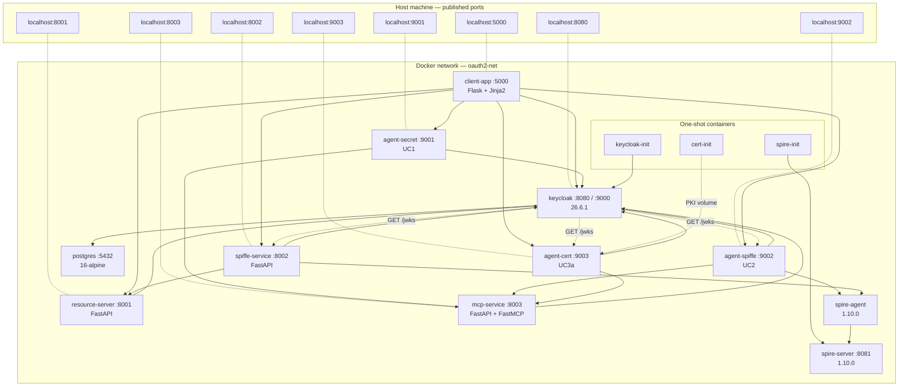

# PROJECT-ARCHITECTURE.md — System architecture reference

This document describes the structural composition of the OAuth2 + JWT + Agentic
AI demo platform. For behavioural specifications see
`docs/PROJECT-SPECIFICATION.md`. For high-level orientation see `CLAUDE.md`.

---

## 1. Topology at a glance



Solid arrows are runtime HTTP/gRPC calls. Dotted arrows from Keycloak to
agents are pull-based JWKS fetches Keycloak makes to verify
`private_key_jwt` client assertions.

---

## 2. Service catalogue

### `postgres` (PostgreSQL 16-alpine)
- **Role:** Keycloak persistence — realm, users, clients, session state.
- **Port:** 5432 (internal only).
- **Persistence:** named volume `postgres_data`.
- **Health:** `pg_isready`. Keycloak depends on `condition: service_healthy`.

### `keycloak` (quay.io/keycloak/keycloak:26.6.1)
- **Role:** OAuth2 / OIDC authorization server for every flow in this project.
- **Ports:** 8080 (HTTP), 9000 (management — `/health/ready`).
- **Mode:** `start-dev --import-realm`. Imports `realm-export.json` on first
  start only; subsequent realm changes must go through `keycloak-init`.
- **Critical env:**
  - `KC_HOSTNAME=localhost` — pins the published URL so JWT `iss` and OIDC
    discovery URLs always match `http://localhost:8080/realms/demo`.
  - `KC_HTTP_ENABLED=true` — HTTPS is intentionally not used.
  - `KC_HEALTH_ENABLED=true` — exposes `/health/ready` on :9000.
- **Realm:** `demo`. Three test users (`alice`/admin, `bob`/user,
  `charlie`/no roles). Service-account users for every confidential client.
- **Health:** TCP probe to :9000 + HTTP `/health/ready`.

### `keycloak-init` (custom, `keycloak-init/Dockerfile`)
- **Role:** One-shot post-import configurator. Idempotently ensures every
  client, role, scope, scope-binding, and role-assignment required by the
  demos exists. Safe to re-run any time.
- **When it runs:** automatically on `docker compose up` (after Keycloak
  healthy). Also manually: `docker compose run --rm keycloak-init`.
- **Restart policy:** `no`. Exits after applying changes.
- **Key responsibilities:**
  - Enables Standard Token Exchange (KC 26.2+) on `middle-tier-client` +
    `demo-client`.
  - Migrates `spiffe-service` to `client-jwt` auth if needed.
  - Creates `dpop-client`, `device-client`, `pkce-client` if missing.
  - Creates `mcp-user` role, `mcp` client scope (with audience mapper),
    `ai-agent-{secret,spiffe,cert}` clients, scope bindings, role
    assignments.
- **Implementation:** `keycloak-init/setup.py`. Every modification follows
  the `ensure_*` pattern with a pre-check + create-or-update path.

### `client-app` (custom, `client-app/Dockerfile`)
- **Role:** Flask web UI on :5000 demonstrating every flow. **Stateless except
  for HTTP sessions** (no database — token data lives in the Flask session
  cookie, encrypted with `SECRET_KEY`).
- **Major subsystems in `app.py`:**
  - 11 OAuth2 / OIDC flow routes (see `PROJECT-SPECIFICATION.md` §2)
  - `/agentic` and `/agentic/<slug>` routes — proxy the three agent
    containers, render structured traces
  - `/docs` and `/docs/<slug>` routes — markdown rendering pipeline
  - `/api/call/<name>` — proxies to the resource server
  - `/token/inspect` — JWT decoder UI
  - `inject_user` context processor — injects auth state into every template
- **Important env:**
  - `KEYCLOAK_EXTERNAL_URL=http://localhost:8080` (`KC_EXT`)
  - `KEYCLOAK_INTERNAL_URL=http://keycloak:8080` (`KC_INT`)
  - One pair of `*_CLIENT_ID` + `*_CLIENT_SECRET` per Keycloak client used
  - `AGENT_{SECRET,SPIFFE,CERT}_URL` — internal URLs of the agentic AI agents
  - `MCP_SERVICE_URL` — for display in the agentic AI section
  - `DOCS_DIR=/app/docs` (bound from host `./docs:/app/docs:ro`)

### `resource-server` (custom, `resource-server/Dockerfile`)
- **Role:** Protected FastAPI on :8001. Validates Keycloak-issued JWTs and
  enforces role-based access on every endpoint.
- **JWKS:** fetched from `KC_INTERNAL_URL/realms/<realm>/protocol/openid-connect/certs`
  at startup (cached with `cache_keys=True`, `cache_jwk_set=False` —
  deliberate: prevents a bad first fetch from poisoning the cache).
- **DPoP endpoint:** `/api/dpop-protected` requires `Authorization: DPoP <token>`
  and a `DPoP:` proof header, validates RFC 9449 binding.
- **No state.** Every request is validated against Keycloak's JWKS.

### `spiffe-service` (custom, `spiffe-service/Dockerfile`)
- **Role:** Production-style SPIFFE workload demo on :8002. **Distinct from
  the Agentic AI section** — this one shows the SPIFFE → Keycloak pattern
  in isolation, used as a "flow 6" demo on the home page.
- **Auth:** RFC 7523 private_key_jwt. Generates an EC key at startup,
  publishes `/jwks` for Keycloak to fetch.
- **PID namespace:** `pid: "service:spire-agent"` — required by the SPIRE
  unix workload attestor (sees calling process's `/proc`).
- **Selector:** `unix:uid:0` (runs as root).
- **Has its own HTML UI** at `/ui` and `/ui/demo` (Jinja2 templates in
  `spiffe-service/templates/`).

### `spire-server` (ghcr.io/spiffe/spire-server:1.10.0)
- **Role:** SPIFFE certificate authority + workload entry registry.
- **Port:** 8081 (internal only).
- **Persistence:** sqlite3 at `/tmp/spire-server-data/datastore.sqlite3`
  (NOT a named volume — fresh on every `down -v`).
- **Why `/tmp` for data dir:** the default `/opt/spire/data/server` is
  shadowed by Docker named volumes in some setups; using `/tmp` avoids that.
- **Config:** `spire/server/server.conf`. KeyManager `memory` (keys
  regenerate on each restart — fine for a demo).
- **Image is scratch-based.** No shell — required workarounds documented in
  CLAUDE.md "SPIRE entries don't auto-update".

### `spire-init` (custom, `spire/init/Dockerfile`)
- **Role:** One-shot SPIRE entry registrar. Generates a join token for the
  agent and creates workload entries.
- **Idempotency:** none. Runs once and exits. After-the-fact entry
  additions require `docker exec` (see CLAUDE.md gotcha).
- **Current entries created:**
  - `spiffe://demo.local/spiffe-service` selector `unix:uid:0`
  - `spiffe://demo.local/ai-agent-spiffe` selector `unix:uid:1000`

### `spire-agent` (custom, `spire/agent-wrapper/Dockerfile`)
- **Role:** SPIFFE workload attestor. Issues SVIDs via the Workload API unix
  socket.
- **Image is also scratch-based.** Wrapper Dockerfile copies the
  statically-compiled binary into Alpine for a usable runtime.
- **Workload API socket:** `/tmp/spire-agent/public/api.sock`, exposed via
  the `spire-agent-socket` named volume to consumers (`spiffe-service`,
  `agent-spiffe`).

### `mcp-service` (custom, `mcp-service/Dockerfile`)
- **Role:** OAuth-protected Model Context Protocol server on :8003. Real
  MCP Streamable HTTP via the official `mcp` Python SDK.
- **Wire endpoints:**
  - `POST /mcp` — MCP JSON-RPC (Bearer JWT required, validates
    `iss + aud=mcp-service + scope=mcp`)
  - `GET /.well-known/oauth-protected-resource` — RFC 9728 discovery
  - `GET /health`, `GET /` (HTML landing)
- **MCP tools exposed:** `list_products`, `get_product_details` (mirror the
  resource-server's data).
- **Critical implementation details:**
  - `FastMCP(..., streamable_http_path="/")` to avoid `/mcp/mcp/` path collision
  - `async with mcp.session_manager.run()` driven from outer FastAPI lifespan
  - Bearer auth enforced as middleware on `/mcp` only (discovery + health
    remain anonymous)

### `cert-init` (custom, `cert-init/Dockerfile`)
- **Role:** One-shot PKI generator for UC3a. Creates a CA + agent leaf cert
  using `openssl`.
- **Idempotency:** YES. Re-running with an existing `agent.crt` is a no-op
  (`if [ -s "$AGENT_KEY" ] && ...`). This preserves the key across restarts.
- **Output:** named volume `agent-cert-pki` containing `ca.{key,crt}`,
  `agent.{key,csr,crt}`.
- **Regenerate:** `docker volume rm oauth2sample_agent-cert-pki && docker
  compose up -d`.

### `agent-secret` (custom, `ai-agents/agent-secret/Dockerfile`)
- **Role:** UC1 demo agent on :9001. Authenticates with static
  `client_id+client_secret`.
- **Contract (every agent in `ai-agents/` has the same):**
  - `GET /health` — `{"status": "healthy", "mode": "live"|"mock"}`
  - `GET /info` — agent metadata
  - `POST /run` — one full agent run, returns structured trace JSON
- **Loop:** OAuth2 token → MCP Streamable HTTP session → tool discovery →
  Anthropic SDK `messages.create` with MCP tools → mock fallback if no
  `ANTHROPIC_API_KEY`.

### `agent-spiffe` (custom, `ai-agents/agent-spiffe/Dockerfile`)
- **Role:** UC2 demo agent on :9002.
- **Auth path:** SPIRE attestation → SVID (display-only) → in-memory EC
  key signs `client_assertion` → Keycloak issues token via `client-jwt`
  authenticator fetching `agent-spiffe:9002/jwks`.
- **Runs as UID 1000** (Dockerfile `useradd -u 1000`); shares PID namespace
  with `spire-agent` (compose `pid: "service:spire-agent"`).

### `agent-cert` (custom, `ai-agents/agent-cert/Dockerfile`)
- **Role:** UC3a demo agent on :9003.
- **Auth path:** load `agent.key` + `agent.crt` from `agent-cert-pki`
  volume → sign `client_assertion` with the cert's private key → Keycloak
  fetches `agent-cert:9003/jwks` (which embeds `x5c` chain + `x5t#S256`).
- **Runs as UID 1100** (Dockerfile `useradd -u 1100`).
- **Reads:** `agent-cert-pki:/pki:ro` (read-only).

---

## 3. Network model

- **One Docker network:** `oauth2-net` (bridge driver). Every service joins it.
- **Host port mappings:** every service except the one-shots and Postgres
  publishes a port on the host (see service catalogue). This is intentional
  — the host-side ports are part of the user-facing demo experience.
- **Inter-service DNS:** Docker's embedded resolver. Services address each
  other by container name (`keycloak:8080`, `mcp-service:8003`, etc.).

---

## 4. Volumes

| Volume | Owner | Consumers | Purpose |
|---|---|---|---|
| `postgres_data` | postgres | postgres | Keycloak database |
| `spire-server-socket` | spire-server | spire-init (rw) | Server admin socket for entry creation |
| `spire-agent-socket` | spire-agent | spiffe-service (ro), agent-spiffe (ro) | Workload API socket |
| `spire-tokens` | spire-init (rw) | spire-agent (ro) | Join token hand-off |
| `agent-cert-pki` | cert-init (rw) | agent-cert (ro) | UC3a CA + agent cert + key |

Named bind mounts (host → container) currently in use:
- `./keycloak/realm-export.json` → `/opt/keycloak/data/import/realm-export.json` (ro)
- `./spire/server` → `/opt/spire/conf/server` (ro)
- `./spire/agent` → `/opt/spire/conf/agent` (ro)
- `./spire/setup.sh` → `/opt/spire/setup.sh` (ro)
- `./spire/agent-start.sh` → `/opt/spire/agent-start.sh` (ro)
- `./docs` → `/app/docs` (ro, client-app)

---

## 5. Authentication flows — architectural mapping

For per-flow specifications see `PROJECT-SPECIFICATION.md`. The relationships
are summarised here:

```
                        Keycloak (issuer = http://localhost:8080/realms/demo)
                                          ↑
              ┌───────────────────────────┼────────────────────────────────────┐
              │ confidential clients (client_id + client_secret)               │
              │   • demo-client          (Auth Code, ROPC, Rescoping)          │
              │   • middle-tier-client   (OBO)                                 │
              │   • service-client       (Client Credentials)                  │
              │   • dpop-client          (DPoP with Password Grant)            │
              │   • device-client        (Device Authorization)                │
              │   • ai-agent-secret      (Agentic AI UC1)                      │
              └───────────────────────────┬────────────────────────────────────┘
              │ public clients (no secret)                                     │
              │   • pkce-client          (PKCE Auth Code)                      │
              └───────────────────────────┬────────────────────────────────────┘
              │ private_key_jwt clients (client-jwt + jwks_url)                │
              │   • spiffe-service       (SPIFFE flow 6 demo)                  │
              │   • ai-agent-spiffe      (Agentic AI UC2)                      │
              │   • ai-agent-cert        (Agentic AI UC3a)                     │
              └────────────────────────────────────────────────────────────────┘
```

The Keycloak realm-level configuration provides:
- Roles: `admin-role`, `user-role`, `mcp-user`
- Default client scopes (per client): `web-origins, acr, profile, email`,
  optionally `roles`
- One named client scope: `mcp` (with audience mapper adding `mcp-service`
  to `aud`)

---

## 6. Build & deployment lifecycle

### Cold start (first `docker compose up -d --build`)

1. Postgres comes up + health-checks.
2. Keycloak starts, imports `realm-export.json` (only because Postgres is
   empty), exposes :8080 + :9000.
3. `keycloak-init` waits for KC healthy, then runs every `ensure_*`
   function in `setup.py`, exits.
4. `spire-server` starts.
5. `spire-init` waits for SPIRE healthy, generates a join token, creates
   workload entries, exits.
6. `spire-agent` consumes the join token, attests to the server, starts
   serving the Workload API.
7. `cert-init` generates the UC3a PKI on the `agent-cert-pki` volume,
   exits.
8. Remaining services start in dependency order:
   - `resource-server` (depends on `keycloak`)
   - `spiffe-service` (depends on `spire-agent` + `keycloak`)
   - `mcp-service` (depends on `keycloak`)
   - `agent-secret`, `agent-spiffe`, `agent-cert` (depend on `mcp-service`)
   - `client-app` (depends on `keycloak`, `resource-server`)

### Warm start (subsequent `docker compose up -d`)

- Postgres has data → Keycloak does NOT re-import the realm. **This is why
  `keycloak-init` runs again** — to apply any new clients/roles/scopes that
  were added after the original realm was imported.
- `cert-init` sees existing PKI → no-op.
- `spire-init` sees existing state → creates entries that may fail if they
  already exist (script tolerates this via `|| true`).

### After editing source

```bash
docker compose up -d --build <service>            # rebuilds and restarts that one
docker compose run --rm keycloak-init             # if Keycloak config changed
```

### Full reset

```bash
docker compose down -v                             # wipes all volumes
docker compose up -d --build                       # fresh cold start
```

---

## 7. Data flow patterns

### Agentic AI run (UC1 example)

```
Browser → POST /agentic/client-secret
       → Flask /agentic/<slug> route
       → requests.get  http://agent-secret:9001/info
       → requests.post http://agent-secret:9001/run         (≤120 s timeout)
       ← agent-secret returns {auth, mcp, turns, final_answer}
       ← Flask renders templates/agentic_result.html
```

Inside `agent-secret POST /run`:
```
agent-secret → POST http://keycloak:8080/realms/demo/.../token  (client_credentials, scope=mcp)
            ← access_token (aud=mcp-service, scope=mcp)
            → streamablehttp_client("http://mcp-service:8003/mcp", Bearer=token)
            → ClientSession.initialize() → tools/list
            ← [list_products, get_product_details]
            → anthropic.Anthropic().messages.create(model=…, tools=…, messages=…)
            ← stop_reason=tool_use → invoke tool on MCP → append → repeat
            ← stop_reason=end_turn → final answer
```

### UC2 differs only in the token-request step:

```
agent-spiffe → spire workload API: fetch_jwt_svids(audience=trust-domain)
            ← JWT-SVID (display only)
            → builds RFC 7523 client_assertion (signed with in-memory EC key)
            → POST http://keycloak:8080/.../token
            ← Keycloak: GET http://agent-spiffe:9002/jwks (validates signature)
            ← access_token
            (rest identical to UC1)
```

### UC3a differs by where the key comes from:

```
agent-cert → load /pki/agent.{key,crt} at startup
          → builds RFC 7523 client_assertion (signed with cert's private key)
          → POST http://keycloak:8080/.../token
          ← Keycloak: GET http://agent-cert:9003/jwks (which embeds x5c + x5t#S256)
          ← access_token
          (rest identical to UC1)
```

### OAuth2 user flow (Authorization Code example)

```
Browser → GET /                                    (Flask)
       → Click "Login" → GET /auth/authorization-code
       → Flask redirects to:
         http://localhost:8080/realms/demo/.../auth?response_type=code&...
       Browser → Keycloak login page → POST credentials
       → 302 to http://localhost:5000/auth/callback?code=X&state=Y
       Browser → GET http://localhost:5000/auth/callback?code=X&state=Y
                 (Flask validates state, exchanges code server-to-server)
       Flask → POST http://keycloak:8080/.../token  (KC_INT)
            ← access_token, id_token, refresh_token
            → store in session
            → redirect to /
```

Key invariant: **browser-facing redirects use `KC_EXT`** (`http://localhost:8080`),
**server-to-server token exchange uses `KC_INT`** (`http://keycloak:8080`).
Both refer to the same Keycloak instance; the dual URL exists because the
browser can't reach the Docker DNS name and the server inside Docker can't
reach the host loopback (depending on Docker host networking).

---

## 8. Persistence model

Persistent state (survives container restart, lost on `down -v`):
- **Postgres data** → entire Keycloak realm, users, sessions, audit log.
- **`agent-cert-pki`** → UC3a CA + agent cert + key.

Ephemeral state (regenerated on every container start):
- All SPIRE keys (KeyManager `memory`).
- All EC keys for SPIFFE-service and `agent-spiffe` (generated at process
  startup, never persisted).
- Flask session cookies (encrypted with `SECRET_KEY` — survive restart only
  if the same `SECRET_KEY` is reused).

No state in the resource-server, mcp-service, or any agent — they are pure
functions of their inputs (incoming JWT + request body).

---

## 9. Failure modes and recovery

| Symptom | Likely cause | Recovery |
|---|---|---|
| Agent run returns "token audience doesn't match" | `mcp` scope not assigned or audience mapper missing | `docker compose run --rm keycloak-init` |
| MCP returns 401 with valid-looking token | Token missing `mcp` scope; check `azp` and `aud` | Verify `keycloak-init` ran; check client's optional scopes |
| `agent-spiffe` returns "SPIRE returned no JWT-SVIDs" | Workload entry not registered, or wrong UID, or PID-namespace not shared | See CLAUDE.md "SPIRE entries don't auto-update" |
| `agent-cert` fails to start with `no such file or directory: /pki/agent.crt` | `cert-init` didn't complete | `docker compose run --rm cert-init` then restart agent-cert |
| Resource server returns "Cannot obtain signing key from Keycloak" | JWKS fetch failed at startup; Keycloak wasn't reachable | Resource-server retries on each request — usually recovers automatically |
| Client-app shows "Token has expired" immediately after login | Clock skew between containers | Restart Docker daemon (rare) — leeway is 30s |
| Token exchange (OBO) returns "Standard token exchange is not enabled" | `standard.token.exchange.enabled` attribute missing on client | `docker compose run --rm keycloak-init` |
| All flows fail after `docker compose up` | Postgres lost state but Keycloak realm has cached config | `docker compose down -v` then `up --build` |

---

## 10. Cross-references

- Per-flow specifications: `docs/PROJECT-SPECIFICATION.md`
- Agentic AI section reference: `docs/agentic-ai.md`
- UC3b (mTLS) deferred plan: `docs/ROADMAP-uc3b-mtls.md`
- Learner-facing OAuth2 flow walkthroughs: `docs/oauth2-flows.md`
- Learner-facing SPIFFE deep dive: `docs/spiffe-oauth2.md`
- OBO manual setup: `docs/obo-manual-setup.md`
- Keycloak ↔ Ping brokering: `docs/keycloakbrokeringtoping.md`
- Original architecture overview (user-facing): `docs/architecture.md`
