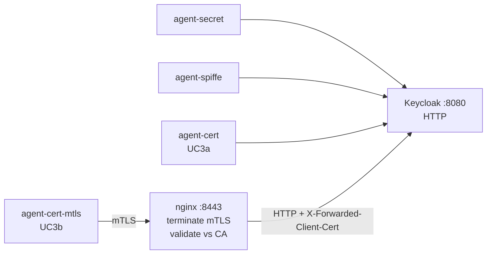

# Roadmap — UC3b: true mTLS client authentication (RFC 8705)

> **Status:** deferred from v1. Not in the live demo. This document is a
> self-contained implementation plan to pick up later.

UC3a (already shipped) uses a certificate's private key to sign an RFC 7523
`client_assertion` JWT — the TLS connection itself is unauthenticated.
UC3b would use the **certificate as the credential during the TLS handshake**
itself, per **RFC 8705 — OAuth 2.0 Mutual-TLS Client Authentication and
Certificate-Bound Access Tokens**.

This document captures everything needed to implement UC3b on top of the
existing v1 platform.

---

## Why bother adding UC3b on top of UC3a?

The user-visible difference is small ("we already have a cert demo"), but
the wire-level and security model differences are real:

| Aspect | UC3a (live) | UC3b (this roadmap) |
|---|---|---|
| Where is the cert used? | Cert's **private key** signs a JWT | Cert is **presented in the TLS handshake** |
| What does Keycloak inspect? | `client_assertion` signature vs JWKS | Verified client cert from the TLS layer |
| Token format | Bearer (replayable) | Bearer **OR** cert-bound (`cnf.x5t#S256`) |
| Sender-constrained tokens | No | **Yes** (the killer feature) |
| Standard | RFC 7523 | RFC 8705 |
| Keycloak authenticator | `client-jwt` (`jwks_url`) | `x509` |

**The unique capability UC3b unlocks is `cnf.x5t#S256` — certificate-bound
access tokens.** A stolen token cannot be replayed because every resource
server call must come from a TLS session terminated by the matching cert.
This is the M2M equivalent of DPoP (UC8 in the main demo).

In regulated sectors (FAPI 2.0, OpenBanking, healthcare) cert-bound tokens
are now the baseline for service-to-service auth — worth showing for
completeness.

---

## Architectural impact

### The problem with adding HTTPS to Keycloak directly

Today the entire stack runs on plain HTTP (`KC_HTTP_ENABLED=true`).
Switching Keycloak to HTTPS would force every service (client-app,
resource-server, spiffe-service, mcp-service, all three agents, keycloak-init)
to either trust a self-signed cert or disable verification. That is invasive
and risks destabilising the eleven existing demos.

### The chosen approach: nginx mTLS-terminating sidecar

Put a small nginx in front of Keycloak's token endpoint that:

1. Listens on a **new port** (`:8443`, HTTPS).
2. Requires + validates a client cert against the demo CA.
3. Forwards the request to Keycloak's plain-HTTP `:8080` with the verified
   cert in `X-Forwarded-Client-Cert` (or `X-SSL-Client-Cert` — the Keycloak
   `x509-direct` authenticator accepts the cert via PEM-in-header).
4. Other services continue using port 8080 with no change.



This isolates the change. Only the new agent uses the new port; only the
new client is configured for mTLS. **No risk to existing demos.**

---

## Required components

### 1. nginx sidecar (`keycloak-mtls-proxy/`)

New directory:
```
keycloak-mtls-proxy/
├── Dockerfile           # FROM nginx:1.27-alpine + config
└── nginx.conf
```

**`nginx.conf` skeleton:**
```nginx
events { worker_connections 1024; }
http {
    server {
        listen 8443 ssl;
        # Server cert for this proxy (NOT the agent cert)
        ssl_certificate     /etc/nginx/tls/server.crt;
        ssl_certificate_key /etc/nginx/tls/server.key;

        # Trust anchor for client certs — the demo CA from cert-init
        ssl_client_certificate /etc/nginx/tls/ca.crt;
        ssl_verify_client      on;
        ssl_verify_depth       2;

        location / {
            # Reject non-token endpoints — keep the attack surface tiny.
            # Optional but recommended: only /realms/demo/protocol/openid-connect/token
            proxy_pass         http://keycloak:8080;
            proxy_set_header   Host              localhost:8080;
            proxy_set_header   X-Forwarded-Proto https;
            proxy_set_header   X-Forwarded-For   $remote_addr;
            # The whole PEM-escaped cert goes into a header Keycloak reads
            proxy_set_header   X-SSL-Client-Cert $ssl_client_escaped_cert;
        }
    }
}
```

Why escaped PEM (`$ssl_client_escaped_cert`) and not DER? Keycloak's
`x509-direct` authenticator expects URL-encoded PEM with newlines preserved
as `%0A`. nginx's built-in variable does exactly this.

### 2. Extension to `cert-init` (or new `mtls-cert-init`)

The agent cert from UC3a is reusable. Two additional artefacts needed:
- nginx server cert + key (CN=`keycloak-mtls-proxy`, signed by the demo CA)
- the CA cert is already available

Either extend `cert-init/setup.sh` to also generate these (when missing) and
write to a second volume `mtls-proxy-pki`, or split into a separate
one-shot. The first is simpler:

```sh
# Add to cert-init/setup.sh, guarded by file-exists check
PROXY_KEY="$OUT_DIR/proxy.key"
PROXY_CRT="$OUT_DIR/proxy.crt"
if [ ! -s "$PROXY_CRT" ]; then
    openssl ecparam -name prime256v1 -genkey -noout -out "$PROXY_KEY"
    openssl req -new -key "$PROXY_KEY" -out /tmp/proxy.csr \
        -subj "/CN=keycloak-mtls-proxy/O=OAuth2 Sample"
    openssl x509 -req -in /tmp/proxy.csr \
        -CA "$CA_CRT" -CAkey "$CA_KEY" -CAcreateserial \
        -out "$PROXY_CRT" -days 365 \
        -extfile /dev/stdin <<'EOF'
[v3]
basicConstraints=critical,CA:FALSE
keyUsage=critical,digitalSignature,keyEncipherment
extendedKeyUsage=serverAuth
subjectAltName=DNS:keycloak-mtls-proxy,DNS:localhost
EOF
fi
```

### 3. Keycloak configuration

Two changes:

**a) Trust the X-Forwarded-* headers from the proxy.**
In `docker-compose.yml` on the `keycloak` service:

```yaml
KC_PROXY_HEADERS: xforwarded
```

This is additive — direct port 8080 access continues to work without
proxy headers; nginx-forwarded requests are interpreted with them.

**b) New Keycloak client `ai-agent-cert-mtls`.**

Add to `keycloak-init/setup.py`:

```python
def ensure_ai_agent_cert_mtls_client(token: str) -> None:
    """Ensure ai-agent-cert-mtls exists with x509 client authentication.

    The "x509" authenticator validates a client certificate that was
    terminated and verified by the reverse proxy.  Subject DN must match
    the configured value exactly.
    """
    h    = {"Authorization": f"Bearer {token}"}
    base = f"{KC_URL}/admin/realms/{REALM}"

    existing = _get(f"{base}/clients", h, params={"clientId": "ai-agent-cert-mtls"}).json()
    if existing:
        # idempotent migration omitted for brevity
        return

    r = httpx.post(f"{base}/clients", headers=h, json={
        "clientId":                  "ai-agent-cert-mtls",
        "enabled":                   True,
        "publicClient":              False,
        "clientAuthenticatorType":   "x509",
        "serviceAccountsEnabled":    True,
        "standardFlowEnabled":       False,
        "directAccessGrantsEnabled": False,
        "protocol":                  "openid-connect",
        "defaultClientScopes":       ["web-origins", "acr", "profile", "email"],
        "optionalClientScopes":      ["roles"],
        "attributes": {
            # Subject DN extracted from the cert by the proxy must match this.
            # cert-init generates the agent cert with this exact CN.
            "x509.subjectdn":                              "CN=ai-agent-cert,O=OAuth2 Sample,OU=Agentic AI",
            "x509.allow.regex.pattern.comparison":         "false",
            # Optional: bind issued tokens to the cert (cnf.x5t#S256).
            # Enabling this is the "killer feature" of UC3b.
            "tls.client.certificate.bound.access.tokens":  "true",
        },
    }, timeout=10)
    r.raise_for_status()
```

Hook into `main()` next to the other `ensure_*_client` calls. Same scope
binding (`ensure_mcp_scope_on_client`) and role assignment
(`ensure_mcp_role_on_service_account`) as the other agents.

### 4. New agent container (`ai-agents/agent-cert-mtls/`)

Mostly a fork of `agent-cert/agent.py`. The auth step changes
dramatically — no `client_assertion`, just an mTLS-enabled HTTP client:

```python
import httpx

# At module init: load the same cert + key cert-init generated.
# Note we ALSO need the CA cert to verify the proxy's server cert.
CA_CERT_PATH = "/pki/ca.crt"
CERT_TUPLE   = ("/pki/agent.crt", "/pki/agent.key")

KC_MTLS_TOKEN_URL = "https://keycloak-mtls-proxy:8443/realms/demo/protocol/openid-connect/token"

async def _get_access_token() -> tuple[str, AuthStep]:
    step = AuthStep()
    try:
        # cert= installs the client cert/key for the TLS handshake.
        # verify=CA_CERT_PATH validates the proxy's server cert.
        async with httpx.AsyncClient(
            cert=CERT_TUPLE, verify=CA_CERT_PATH, timeout=10.0
        ) as client:
            resp = await client.post(KC_MTLS_TOKEN_URL, data={
                "grant_type": "client_credentials",
                # client_id is REQUIRED — Keycloak uses it to find the client,
                # then validates the cert subject DN against that client's config.
                "client_id":  "ai-agent-cert-mtls",
                "scope":      "mcp",
                # NO client_secret, NO client_assertion.
            })
            step.status_code = resp.status_code
            # ... same handling as agent-cert ...
```

**Trace addition:** since UC3b's distinctive feature is cert-bound tokens,
the trace should highlight the `cnf.x5t#S256` claim if present:

```python
cnf = token_claims.get("cnf", {})
if "x5t#S256" in cnf:
    # Render in the UI: "✓ Access token is cert-bound to thumbprint xxx"
```

### 5. docker-compose entries

```yaml
keycloak-mtls-proxy:
  build:
    context: ./keycloak-mtls-proxy
  container_name: oauth2-keycloak-mtls-proxy
  volumes:
    - agent-cert-pki:/etc/nginx/tls:ro
  ports:
    - "8443:8443"
  depends_on:
    cert-init:
      condition: service_completed_successfully
    keycloak:
      condition: service_healthy
  networks:
    - oauth2-net

agent-cert-mtls:
  build:
    context: ./ai-agents/agent-cert-mtls
  container_name: oauth2-agent-cert-mtls
  environment:
    PKI_DIR: /pki
    KEYCLOAK_MTLS_TOKEN_URL: https://keycloak-mtls-proxy:8443/realms/demo/protocol/openid-connect/token
    AGENT_CLIENT_ID: ai-agent-cert-mtls
    MCP_SERVER_URL: http://mcp-service:8003/mcp
    ANTHROPIC_API_KEY: ${ANTHROPIC_API_KEY:-}
  volumes:
    - agent-cert-pki:/pki:ro
  ports:
    - "9004:9004"
  depends_on:
    cert-init:
      condition: service_completed_successfully
    keycloak-mtls-proxy:
      condition: service_started
    mcp-service:
      condition: service_started
  networks:
    - oauth2-net
```

On the existing `keycloak` service, add `KC_PROXY_HEADERS: xforwarded`.

### 6. client-app integration

Add to `AGENT_REGISTRY` in `client-app/app.py`:

```python
"cert-mtls": {
    "title":       "X.509 Certificate (mTLS)",
    "url":         os.getenv("AGENT_CERT_MTLS_URL", "http://agent-cert-mtls:9004"),
    "description": "Service principal authenticating via true mTLS (RFC 8705). The certificate "
                   "is presented during the TLS handshake itself. Optionally issues cert-bound "
                   "tokens (cnf.x5t#S256) so a stolen token cannot be replayed elsewhere.",
    "icon":        "bi-shield-lock-fill",
    "color":       "danger",
    "badge":       "UC3b · True mTLS",
    "rfc":         "RFC 8705",
},
```

Plus the corresponding env var passthrough in `docker-compose.yml`.

Templates: add a button on `index.html` and `agentic_index.html`. Extend
`agentic_result.html` to render `cnf.x5t#S256` when present (a small
"Sender-constrained" green badge next to the access token claims).

### 7. Documentation

Add a UC3b section to `docs/agentic-ai.md` mirroring the existing UC3a
section. Include a sequence diagram showing the TLS handshake step and
the `cnf` claim emission. Update the comparison table at the top.

---

## Step-by-step implementation order

Recommended sequence (each step is independently testable):

1. **PKI extension** — add nginx server cert generation to `cert-init`. Run
   it, confirm `/pki/proxy.crt` exists.
2. **nginx proxy** — build the sidecar, point it at Keycloak, test with
   `curl --cert agent.crt --key agent.key --cacert ca.crt https://localhost:8443/realms/demo/.well-known/openid-configuration`.
   Expect 200 with the discovery doc.
3. **Keycloak `KC_PROXY_HEADERS`** — restart Keycloak. Verify all existing
   demos still work (run UC1, UC2, UC3a once each).
4. **New Keycloak client** — run keycloak-init. Verify `ai-agent-cert-mtls`
   exists with `clientAuthenticatorType=x509`.
5. **Manual token request** — outside the agent code:
   ```bash
   curl -v --cert agent.crt --key agent.key --cacert ca.crt \
        -d "grant_type=client_credentials&client_id=ai-agent-cert-mtls&scope=mcp" \
        https://localhost:8443/realms/demo/protocol/openid-connect/token
   ```
   If this returns a token with `aud=mcp-service` and (with the attribute
   set) `cnf.x5t#S256`, the hardest part is done.
6. **Agent container** — fork agent-cert, swap the `_get_access_token`
   implementation, leave everything else identical.
7. **Client-app wiring** — registry entry, template tweaks.
8. **Documentation update**.

Stage 5 is the make-or-break step. If you can get a token there, the rest
is plumbing.

---

## Known gotchas

These are the issues that will eat time if not anticipated.

### Subject DN format

Keycloak's `x509.subjectdn` attribute must match the exact format the
extractor produces, which **differs between OpenSSL versions and between
front-end proxies**. Use `cryptography`'s `rfc4514_string()` to compute
the expected value at startup of the agent, log it, and copy that exact
string into the Keycloak config. The agent cert from UC3a yields:

```
CN=ai-agent-cert,O=OAuth2 Sample,OU=Agentic AI
```

If the configured DN includes spaces around commas, KC will silently
reject the cert. Watch the Keycloak server logs for
`x509 authenticator failed` lines.

### Cert in header vs cert in TLS layer

Two completely different Keycloak authenticators:
- `x509` — KC itself terminates TLS, reads the cert from the TLS context.
- `x509-direct` — KC behind a proxy, reads the cert from a request header.

For the nginx-proxy architecture you want **`x509-direct`** (not just
`x509`). Set `clientAuthenticatorType: "x509-direct"` (verify the exact
name in your KC version — it has changed between releases). Also set
the attribute `x509.cert.header.name` if it differs from the default.

### `KC_PROXY_HEADERS=xforwarded` vs `KC_PROXY=edge`

`KC_PROXY=edge` is deprecated in KC 25+. Use `KC_PROXY_HEADERS=xforwarded`.
With this set, KC trusts `X-Forwarded-Proto`, `X-Forwarded-Host`,
`X-Forwarded-For` from ANY upstream — which is fine on a private docker
network but would need source-IP restrictions in production.

### Cert-bound tokens at the resource server

If `tls.client.certificate.bound.access.tokens=true` is set on the
client, every resource server call with that token must include
`X-SSL-Client-Cert` matching the token's `cnf.x5t#S256`. The MCP server
does **not** enforce this in v1. To make the cert binding meaningful
end-to-end, the MCP server would need to:

1. Decode `cnf.x5t#S256` from the access token.
2. Read the client cert from a forwarded header (which means MCP would
   also need to be behind the nginx sidecar).
3. Compare the cert's SHA-256 thumbprint to the claim.

This is its own mini-iteration. The simpler v1 of UC3b enables the binding
on the token but doesn't enforce it at MCP; the agent can still present
the token to mcp-service over plain HTTP. The trace surfaces the `cnf`
claim so the reader sees the binding exists, even if it's not validated.

If you want full enforcement, that's a UC3b.2 follow-up.

### Volume sharing

The nginx proxy and the agent both need `/pki` content but the proxy
needs `proxy.crt` + `proxy.key` and the agent needs `agent.crt` +
`agent.key`. Sharing the same volume is fine — both files coexist;
read-only mounts on both consumers prevent accidental cross-writes.

### Testing inside Docker

`agent-cert-mtls` will resolve `keycloak-mtls-proxy:8443` via Docker DNS,
but `verify=ca.crt` validates the server cert's CN/SAN against the
hostname. The nginx server cert must have `SAN: keycloak-mtls-proxy` (and
optionally `localhost` for host-side curl testing). The PKI extension
above does this.

---

## Testing strategy

End-to-end checklist after implementation:

```bash
# Discovery still works
curl -s http://localhost:8080/realms/demo/.well-known/openid-configuration | jq .issuer
# → "http://localhost:8080/realms/demo"

# mTLS endpoint with no cert → 400 (TLS handshake fails)
curl -k https://localhost:8443/realms/demo/protocol/openid-connect/token

# mTLS with correct cert + correct client_id → token
curl --cert ai-agents/agent-cert-mtls/test-data/agent.crt \
     --key  ai-agents/agent-cert-mtls/test-data/agent.key \
     --cacert ai-agents/agent-cert-mtls/test-data/ca.crt \
     -d "grant_type=client_credentials&client_id=ai-agent-cert-mtls&scope=mcp" \
     https://localhost:8443/realms/demo/protocol/openid-connect/token | jq

# Token should contain:
#   aud = "mcp-service"
#   scope contains "mcp"
#   cnf.x5t#S256 = base64url(sha256(agent.crt DER))

# Existing UC3a still works (regression check)
curl -X POST http://localhost:9003/run

# New UC3b end-to-end
curl -X POST http://localhost:9004/run

# Flask UI
open http://localhost:5000/agentic/cert-mtls
```

The most useful diagnostic is `docker logs oauth2-keycloak | grep -i
x509` — Keycloak logs each `x509-direct` authentication attempt with the
DN it extracted, which makes DN-mismatch debugging fast.

---

## Estimated effort

Realistic budget for an engineer familiar with the codebase:

| Step | Time |
|---|---|
| nginx config + cert generation | 30 min |
| Keycloak config + new client | 30 min |
| Manual token-endpoint test (step 5) | 30–120 min ← biggest variable |
| Agent container | 60 min |
| client-app integration | 30 min |
| Documentation | 60 min |
| **Total** | **~4 hours** with smooth path; **~8 hours** if step 5 fights back |

mTLS debugging is famously painful (one wrong character in a DN, one
missing SAN, one wrong header name → cryptic 401). Plan for it.

---

## When NOT to do this

- If the goal is just to show "certificate-based identity", UC3a covers
  that. The reader sees the cert, the key, the chain, the JWK with
  `x5c`, the assertion signed by the cert key.
- If you can't easily add `KC_PROXY_HEADERS` without disrupting a shared
  deployment, the cost-benefit shifts.

## When to do this

- You want the demo to span the full RFC 7523 / RFC 8705 axis.
- You specifically want to demonstrate cert-bound tokens (`cnf.x5t#S256`)
  as the M2M counterpart to DPoP.
- You're building this for an audience in regulated industries (banking,
  healthcare) where mTLS is the baseline expectation.

---

## Cross-references

- v1 implementation: `docs/agentic-ai.md`
- UC3a cert generation: `cert-init/setup.sh`
- UC3a agent: `ai-agents/agent-cert/agent.py`
- Keycloak setup pattern to copy: `keycloak-init/setup.py` →
  `ensure_ai_agent_cert_client()`
- RFC 8705: https://datatracker.ietf.org/doc/html/rfc8705
- Keycloak X509 client authenticator docs:
  https://www.keycloak.org/docs/latest/server_admin/index.html#x509-client-authenticator
