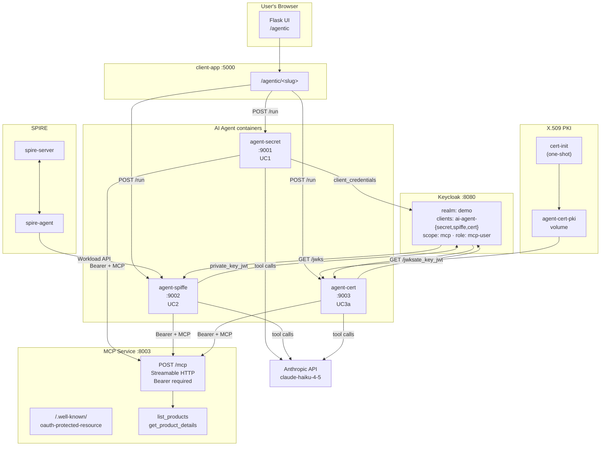
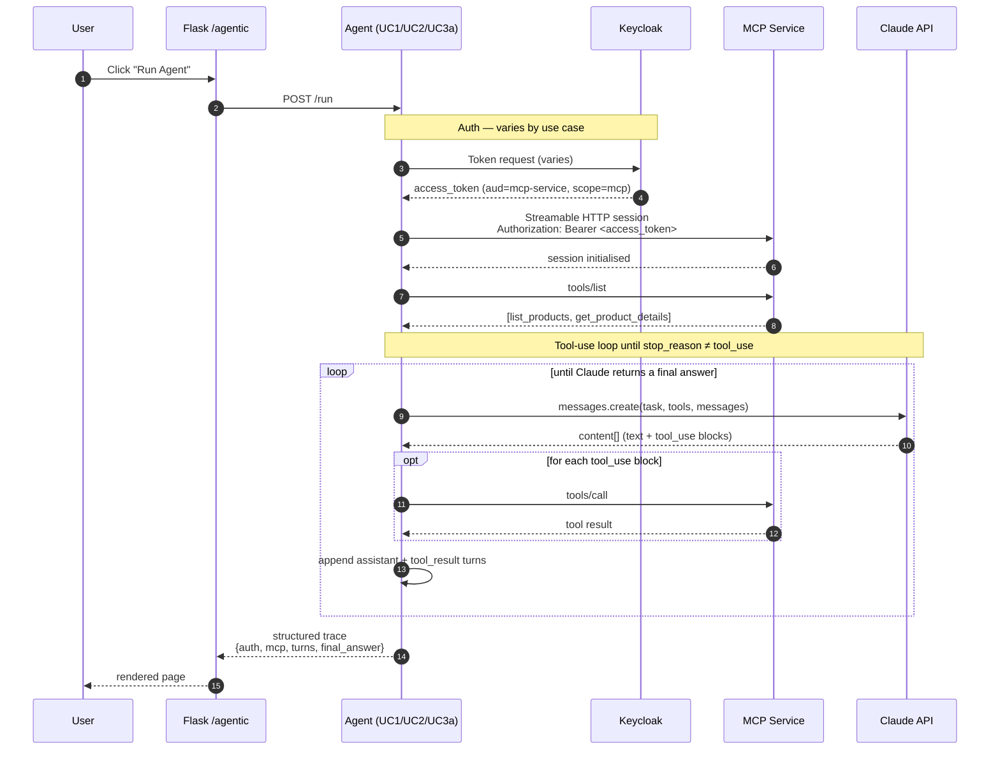
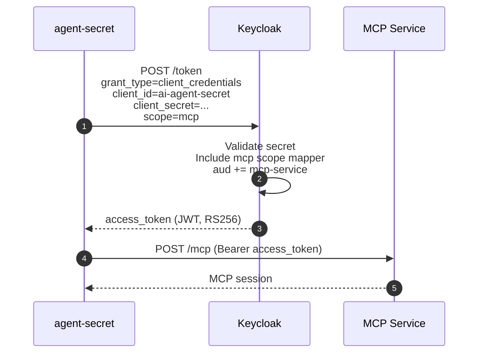
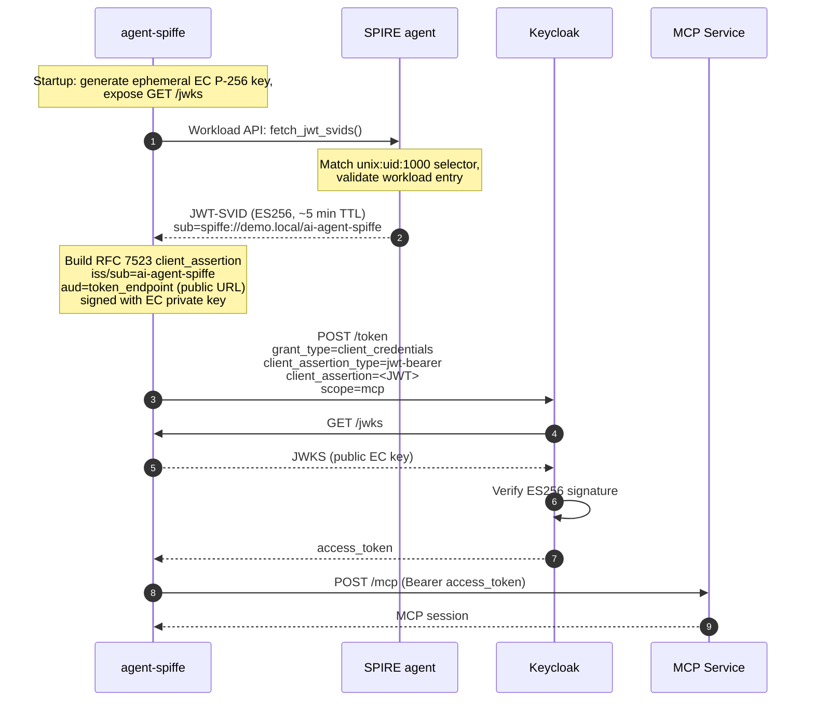
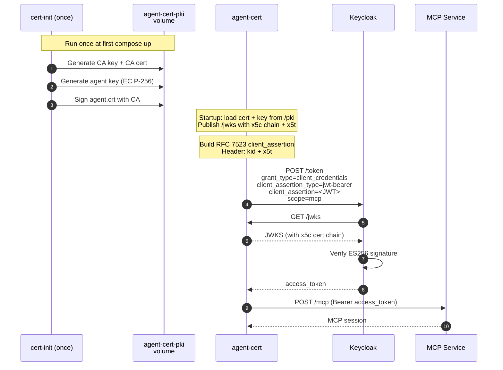

# Agentic AI — Authenticated MCP Access

This section adds three demos to the project, each showing a different way an
AI agent can authenticate to a protected **Model Context Protocol (MCP)**
server. The agents are containerised Python services that drive the official
**Anthropic SDK** tool-use loop; the MCP server speaks the real
**MCP Streamable HTTP** transport (official `mcp` Python SDK) over OAuth 2.1
Bearer tokens.

The three patterns differ only in *how the agent obtains its access token*:

| # | Use case | Auth mechanism | Key freshness | Demo container |
|---|----------|----------------|---------------|----------------|
| UC1 | **Client Secret** | OAuth 2.0 Client Credentials (RFC 6749 §4.4) | Static secret | `agent-secret` (:9001) |
| UC2 | **SPIFFE Workload Identity** | SPIRE attestation → RFC 7523 `private_key_jwt` | Ephemeral key per restart | `agent-spiffe` (:9002) |
| UC3a | **X.509 Certificate** | CA-issued cert → RFC 7523 `private_key_jwt` | Long-lived cert + key | `agent-cert` (:9003) |

The MCP server (`mcp-service` on port 8003) is the same for all three. The
agents all run the same task against the same tools — only the credential
machinery changes.

---

## Architecture



The Flask client-app is a passthrough — it triggers each agent's `/run`
endpoint and renders the structured trace the agent returns. All the OAuth2,
SPIFFE, and MCP work happens inside the agent containers, which is what
would run in production.

---

## MCP server protection

The MCP server is a FastAPI app with the official `mcp` SDK mounted at
`/mcp`. Bearer enforcement is implemented as middleware that gates the MCP
endpoint only — discovery and health stay anonymous.

### Discovery (RFC 9728)

```
GET http://localhost:8003/.well-known/oauth-protected-resource
```

```json
{
  "resource":                 "http://localhost:8003",
  "authorization_servers":    ["http://localhost:8080/realms/demo"],
  "bearer_methods_supported": ["header"],
  "scopes_supported":         ["mcp"]
}
```

Any MCP client without a token sees this metadata advertised in the
`WWW-Authenticate` header of a 401 response and can use it to bootstrap an
OAuth flow per the MCP authorization spec.

### Token validation

Performed on every request to `/mcp`, in order:

1. JWKS signing-key resolution via `kid`
2. RS256 signature
3. `iss` matches Keycloak
4. `exp` not in the past (30 s leeway)
5. `aud` contains `mcp-service`
6. `scope` claim contains `mcp`

Failure produces 401 with `WWW-Authenticate: Bearer error="invalid_token",
resource_metadata="..."`.

### Tools

| Tool | Input | Returns |
|------|-------|---------|
| `list_products` | none | Array of products (id, name, price, category, stock) |
| `get_product_details` | `product_id: int` | One product or `{"error": "..."}` |

These tools share the catalogue data with `resource-server` so the demo
remains tightly coupled to the existing OAuth2 demos.

---

## The agent tool-use loop

All three agents run the same loop, abstracted from the credential mechanism:



If `ANTHROPIC_API_KEY` is unset each agent runs a deterministic mock loop
that issues the same MCP calls a real run would, so the demo works
end-to-end without an external dependency.

---

## UC1 — Client Secret

### Flow



### Prerequisites

- Client `ai-agent-secret`: `serviceAccountsEnabled=true`, secret configured
- `mcp` client scope (with audience mapper `aud += mcp-service`) assigned as **optional** scope on the client
- Realm role `mcp-user` assigned to the client's service account

### What makes this UC1

- A static `client_secret` is the credential.
- Simplest pattern, suitable when a secret store is available (Vault,
  Kubernetes secrets, AWS Secrets Manager).
- **Risk:** secret theft = full impersonation until rotation.

### Run

```bash
# In Flask UI
open http://localhost:5000/agentic/client-secret

# Or directly
curl -s -X POST http://localhost:9001/run | jq
```

---

## UC2 — SPIFFE Workload Identity

### Flow



### Prerequisites

- SPIRE workload entry: `spiffe://demo.local/ai-agent-spiffe`, selector `unix:uid:1000`, parent `spiffe://demo.local/agents/demo-agent`
- Agent container runs as UID 1000 (in `Dockerfile`: `useradd -u 1000`) and shares PID namespace with `spire-agent` (`pid: "service:spire-agent"` in `docker-compose.yml`)
- Keycloak client `ai-agent-spiffe`: `clientAuthenticatorType=client-jwt`, `jwks_url=http://agent-spiffe:9002/jwks`
- `mcp` scope as optional, `mcp-user` role on the service account

### Why two JWTs (SVID and client_assertion)

RFC 7523 requires `iss == sub == OAuth2 client_id`, but the JWT-SVID's `sub`
is the SPIFFE ID (`spiffe://demo.local/ai-agent-spiffe`) — Keycloak would
refuse it. So the agent uses:

| JWT | Purpose | iss/sub | Key | Signed by |
|-----|---------|---------|-----|-----------|
| JWT-SVID | Runtime proof of attestation (shown in trace) | SPIFFE ID | SPIRE | SPIRE CA |
| client_assertion | OAuth2 client auth | `ai-agent-spiffe` | Agent's ephemeral EC key | Agent itself |

Both come from the same process; the SPIFFE link is implicit (only an
attested workload could have got far enough to call Keycloak).

### What makes this UC2

- No static credential anywhere. The agent has no secret at any moment.
- Key rotates on every container restart.
- Compromising one running container does not compromise others.

### Run

```bash
open http://localhost:5000/agentic/spiffe
curl -s -X POST http://localhost:9002/run | jq
```

---

## UC3a — X.509 Certificate

### Flow



### Prerequisites

- `cert-init` ran once and populated the `agent-cert-pki` volume with `ca.crt`, `agent.key`, `agent.crt`
- Keycloak client `ai-agent-cert`: `clientAuthenticatorType=client-jwt`, `jwks_url=http://agent-cert:9003/jwks`
- `mcp` scope as optional, `mcp-user` role on the service account

### What makes this UC3a

- The certificate IS the credential. Closer to corporate PKI workflows
  (CA → cert → service).
- Key is long-lived and persisted in a Docker volume — restarting the agent
  reuses the same key, so the Keycloak-side JWK keeps matching.
- The JWKS exposes `x5c` (DER cert, base64) and `x5t#S256` (cert thumbprint)
  so the cert chain behind the key is verifiable. Per RFC 7517 §4.7:
  - `x5c` uses **base64** with padding (not base64url)
  - `x` / `y` use **base64url** without padding

### UC3a versus UC2 — the differentiator

Both clients are configured identically on Keycloak (`client-jwt` +
`jwks_url`). The educational difference is in the agent:

| Aspect | UC2 (SPIFFE) | UC3a (Certificate) |
|--------|--------------|--------------------|
| Where does the key come from? | Generated in memory at startup | Loaded from `agent.key` on a shared volume |
| Lifetime | Rotates on every container restart | Long-lived (validity in `agent.crt`) |
| Runtime attestation | Yes (SPIRE selector check) | No — possession of `agent.key` is sufficient |
| Identity proof | JWT-SVID issued by SPIRE | X.509 cert chain (CA → leaf) |
| Recovery from key theft | Restart, key gone | Revoke cert, rotate CA |
| JWKS contents | `kty`, `crv`, `x`, `y` | + `x5c`, `x5t#S256` |

### Regenerating the cert

```bash
docker compose down
docker volume rm oauth2sample_agent-cert-pki
docker compose up -d        # cert-init regenerates everything
```

### Run

```bash
open http://localhost:5000/agentic/cert
curl -s -X POST http://localhost:9003/run | jq
```

---

## Implementation notes

A handful of details we had to get right while building this section, kept
here so anyone extending the demos doesn't trip over the same problems.

### FastMCP path collision with Starlette mount

`FastMCP.streamable_http_app()` defaults its internal path to `/mcp`. When
that app is mounted under `/mcp` in the parent FastAPI app, the effective
URL becomes `/mcp/mcp/` and the parent issues a 307 redirect that the
client follows to a 404. Fix:

```python
mcp = FastMCP("mcp-service", stateless_http=True, streamable_http_path="/")
app.mount("/mcp", mcp.streamable_http_app())
```

### FastMCP session manager lifespan

The Starlette app returned by `streamable_http_app()` ships its own
lifespan that starts the session manager. **Mounted apps do not get their
lifespan run** by the parent — so `/mcp` returns 500 until the parent
drives the session manager itself:

```python
@asynccontextmanager
async def lifespan(app: FastAPI):
    # ... your own setup ...
    async with mcp.session_manager.run():
        yield
```

### FastMCP list returns are one TextContent per element

A tool returning `list[dict]` produces multiple `TextContent` objects in
the `CallToolResult.content` array, not a single JSON array. A naive
`content[0].text` only sees the first element. Collect all parts:

```python
texts = [c.text for c in result.content if getattr(c, "text", None)]
parsed = [json.loads(t) for t in texts]
```

### Keycloak assertion audience

Keycloak validates a `client_assertion`'s `aud` claim against its
**published** token endpoint URL (`KC_HOSTNAME`-derived, e.g.
`http://localhost:8080/...`), not the internal Docker URL the request
arrives on. Use OIDC discovery to find the right value at startup:

```python
disc = httpx.get(f"{KC_INT}/realms/{REALM}/.well-known/openid-configuration").json()
aud  = disc["token_endpoint"]
```

### SPIRE selectors must be distinct

`spiffe-service` and `ai-agent-spiffe` both connect to the same SPIRE
agent. If both register with `unix:uid:0`, SPIRE issues BOTH SPIFFE IDs to
BOTH containers — and the audit trail is meaningless. The fix: register
the new agent with a different UID (`unix:uid:1000`) and run the container
as that UID.

### `x5c` encoding

`x5c` entries are **base64** (RFC 4648 §4, padded), not base64url. The JWK's
`x` and `y` are base64url without padding. Using the wrong one breaks the
JWKS endpoint silently.

---

## Troubleshooting

### Agent returns `"token audience doesn't match"`

The `mcp` scope wasn't included in the token request, or the audience mapper
isn't on the scope, or the scope isn't assigned to the client. Re-run
`docker compose run --rm keycloak-init` — it's idempotent.

### MCP returns 401 even with a valid-looking token

Check the token contains `scope=...mcp...`. The MCP server enforces both
audience and scope; either failure produces the same 401.

### Agent run returns `"unhandled errors in a TaskGroup (1 sub-exception)"`

This is anyio's wrapper. Look in the agent's container logs
(`docker logs oauth2-agent-secret`) — the actual exception is nested
inside. Common causes: MCP server unreachable, `/jwks` not responding (for
UC2/UC3), bad audience.

### `agent-spiffe` returns `"SPIRE returned no JWT-SVIDs"`

Either the workload entry isn't registered (check
`spire-server entry show`), or the selector doesn't match (the container
must run as UID 1000 and share the agent's PID namespace).

### `agent-cert` fails to start with "no such file or directory: /pki/agent.crt"

`cert-init` didn't run. From the host:
```bash
docker compose run --rm cert-init
docker compose up -d agent-cert
```

### Resetting the entire Agentic AI stack

```bash
docker compose down -v          # nukes all volumes including the cert PKI
docker compose up -d --build    # rebuilds, regenerates the cert, re-runs keycloak-init
```
