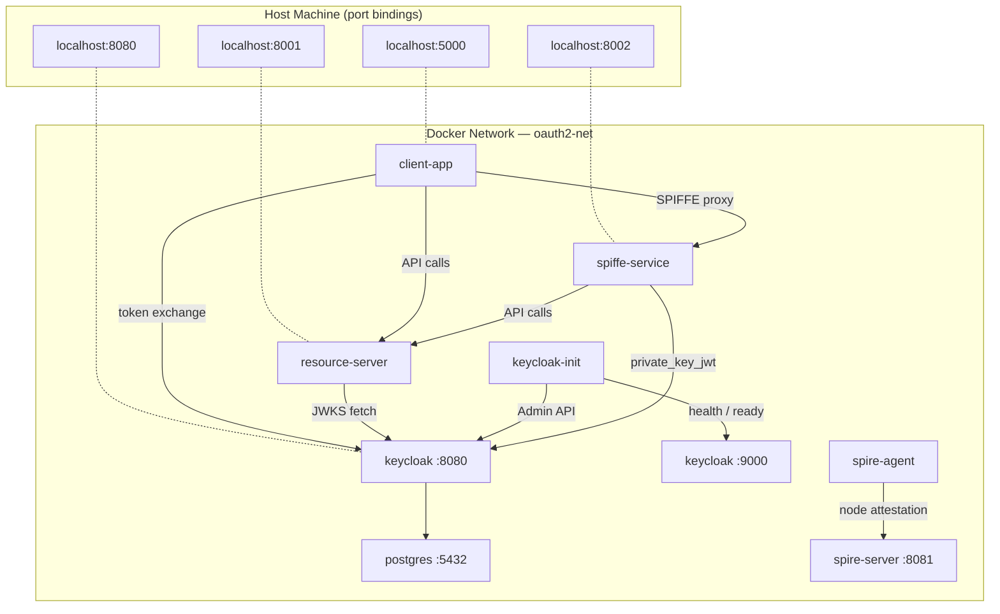
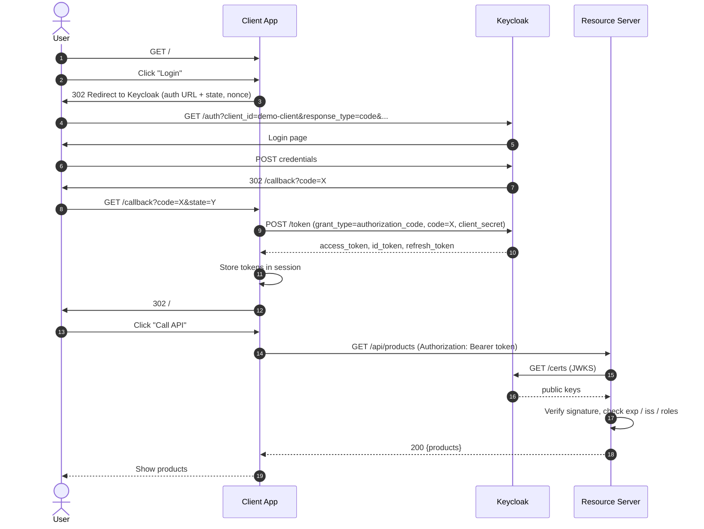

# Architecture

## Components

### Keycloak (port 8080, management port 9000)

Keycloak is the **Identity Provider (IdP)** and **Authorisation Server**.

Version: **26.6.1** (`quay.io/keycloak/keycloak:26.6.1`)

Responsibilities:
- Authenticates users (login form, MFA, social login, etc.)
- Issues signed JWT tokens after successful authentication
- Manages users, roles, clients, and realms
- Exposes a JWKS endpoint so resource servers can verify token signatures
- Handles token refresh and SSO session management
- Supports RFC 8693 Standard Token Exchange (GA in KC 26.2+ — no feature flags required)
- Enforces DPoP proof-of-possession (RFC 9449) on `dpop-client`
- Implements Device Authorization Grant (RFC 8628) on `device-client`
- Enforces PKCE (RFC 7636) S256 on `pkce-client`

> **Health endpoint (KC 26+):** The health and readiness checks moved to the management
> interface on port 9000 (`/health/ready`). The Docker healthcheck and `keycloak-init` both
> poll `http://keycloak:9000/health/ready`, not the main port 8080.

Key Keycloak concepts used in this demo:

| Concept | Description |
|---|---|
| **Realm** | An isolated namespace (`demo`) containing its own users, clients, and roles |
| **Client** | An application registered with Keycloak |
| **Confidential client** | Has a `client_secret`; token exchange happens server-side |
| **Public client** | No `client_secret`; uses PKCE as a substitute |
| **Service account** | A non-human identity attached to a client (for Client Credentials) |
| **Realm role** | A role scoped to the realm (`admin-role`, `user-role`) |
| **JWKS** | JSON Web Key Set — the Keycloak public keys used to verify JWT signatures |

Clients registered in the `demo` realm:

| Client | Flow | Purpose |
|--------|------|---------|
| `demo-client` | Auth Code + Password | Browser login and ROPC testing; confidential |
| `service-client` | Client Credentials | Machine-to-machine demo; confidential |
| `middle-tier-client` | Client Credentials | On-Behalf-Of / rescoping actor; confidential |
| `spiffe-service` | Client Credentials | RFC 7523 private_key_jwt workload identity; **no secret** |
| `dpop-client` | Password Grant | DPoP enforcement (`dpop.bound.access.tokens: true`); confidential |
| `device-client` | Device Authorization Grant | RFC 8628 browserless flow; confidential |
| `pkce-client` | Authorization Code | PKCE S256 enforcement; **public** (no secret) |

### Keycloak Init (one-shot container)

A Python container (`keycloak-init/setup.py`) that runs once after Keycloak becomes healthy,
then exits. It configures things that cannot be expressed in `realm-export.json` or that must
survive volume resets:

1. **Standard Token Exchange** — sets `standard.token.exchange.enabled = true` on
   `middle-tier-client`, enabling On-Behalf-Of and rescoping exchanges (KC 26.2+ GA).
2. **`spiffe-service` client provisioning** — creates or migrates the client to use
   `client-jwt` authentication (`clientAuthenticatorType = "client-jwt"`, JWKS URL pointing
   to `http://spiffe-service:8002/jwks`), and assigns `user-role` to its service account.
3. **`dpop-client` provisioning** — creates the DPoP-enforced client with the
   `dpop.bound.access.tokens: true` attribute.
4. **`device-client` provisioning** — creates the Device Authorization Grant client with the
   `oauth2.device.authorization.grant.enabled: true` attribute.
5. **`pkce-client` provisioning** — creates the public PKCE client with `publicClient: true`
   and `pkce.code.challenge.method: S256`.

All five `ensure_*()` functions are idempotent — re-running `keycloak-init` is safe.

### Resource Server (port 8001)

A **FastAPI** application that represents a protected backend API.

It has no user database of its own — it trusts tokens issued by Keycloak entirely.
Every protected endpoint:

1. Extracts the `Bearer` (or `DPoP`) token from the `Authorization` header
2. Fetches Keycloak's JWKS (cached in memory after first fetch)
3. Verifies the JWT signature using the matching public key (`kid` header claim)
4. Validates `iss`, `exp` claims
5. Checks `realm_access.roles` for role-protected routes
6. For `/api/dpop-protected`: validates the DPoP proof header and verifies the `cnf.jkt`
   thumbprint matches the key used to sign the proof

The resource server **never** calls Keycloak to validate a token — it validates the
cryptographic signature locally using Keycloak's public key. This makes validation
stateless and extremely fast. The DPoP endpoint is an exception: it additionally verifies
the per-request proof to confirm sender possession.

### Client Application (port 5000)

A **Flask** web application that demonstrates all 11 OAuth2/OIDC flows.

It acts as the OAuth2 **client** (not the resource server, not the IdP).
Responsibilities:
- Redirect the user's browser to Keycloak for authentication (Auth Code and PKCE flows)
- Exchange the authorization code for tokens (server-side, never in the browser)
- Store tokens in the server-side Flask session
- Use the access token to call the Resource Server on behalf of the user
- Perform On-Behalf-Of and rescoping token exchanges (RFC 8693) via `middle-tier-client`
- Proxy requests to `spiffe-service` and display the workload identity demo
- Generate ephemeral EC key pairs and DPoP proofs (RFC 9449)
- Manage the Device Authorization Grant polling loop (RFC 8628)
- Generate PKCE `code_verifier` / `code_challenge` pairs and complete the public-client exchange
- Call the introspection endpoint and demonstrate revocation state change (RFC 7662)
- Fetch OIDC `id_token`, UserInfo, and Discovery document

### SPIFFE Service (port 8002)

A **FastAPI** workload that demonstrates machine identity via **SPIFFE/SPIRE** instead
of static secrets. See [spiffe-oauth2.md](spiffe-oauth2.md) for a full explanation.

The service exposes both a JSON API and a Bootstrap HTML UI:

| Path | Returns | Purpose |
|------|---------|---------|
| `GET /ui` | HTML | Service home — config, flow diagram, endpoint reference |
| `GET /ui/demo` | HTML | Interactive demo runner (calls `/demo` via AJAX, renders results inline) |
| `GET /` | JSON | Service info (API) |
| `GET /jwks` | JSON | Public JWKS — Keycloak fetches this to validate `client_assertion` |
| `GET /svid` | JSON | Raw JWT-SVID claims from SPIRE (inspection) |
| `GET /demo` | JSON | Full 4-step demo (workload attestation → private_key_jwt → resource API) |
| `GET /docs` | HTML | FastAPI / Swagger UI |

### SPIRE Server

The SPIRE **Certificate Authority and registry**. Stores workload registration entries
and issues JWT-SVIDs to attested workloads via the SPIRE agent. Runs gRPC on port 8081
(internal only).

### SPIRE Init (one-shot container)

Generates a **join token** with a fixed agent SPIFFE ID, registers the
`spiffe://demo.local/spiffe-service` workload entry, and writes the token to a shared
volume. Exits after completion.

### SPIRE Agent

A node-local daemon that:
1. Connects to the SPIRE server using the join token (node attestation)
2. Serves the **SPIRE Workload API** over a unix socket
3. Attests workloads using the `unix` WorkloadAttestor (by OS UID)
4. Issues short-lived JWT-SVIDs to attested workloads on demand

### PostgreSQL (port 5432)

Stores Keycloak's internal state (users, sessions, keys, realm configuration).
Not accessed directly by the Python applications.

---

## Network topology



**Important:** the browser uses `localhost:8080` to reach Keycloak (via port mapping).
Server-to-server calls inside Docker use the container name `keycloak:8080`.
`KC_HOSTNAME=localhost` ensures all JWT `iss` claims always say `http://localhost:8080/...`.

---

## Token flow — Authorization Code



---

## JWT Structure

A JWT has three Base64URL-encoded parts separated by dots:

```
eyJhbGciOiJSUzI1NiIsInR5cCI6IkpXVCIsImtpZCI6Ii4uLiJ9   ← Header
.
eyJzdWIiOiI1NjRmYy4uLiIsInJlYWxtX2FjY2Vzcy4uLiJ9        ← Payload
.
SflKxwRJSMeKKF2QT4fwpMeJf36POk6yJV_adQssw5c              ← Signature
```

### Header

```json
{
  "alg": "RS256",
  "typ": "JWT",
  "kid": "abc123"
}
```

### Payload (selected claims)

```json
{
  "sub":                "564fc7e2-...",
  "iss":                "http://localhost:8080/realms/demo",
  "aud":                ["account"],
  "azp":                "demo-client",
  "exp":                1718000000,
  "iat":                1717999700,
  "preferred_username": "alice",
  "email":              "alice@example.com",
  "realm_access": {
    "roles": ["admin-role", "user-role", "offline_access"]
  },
  "scope": "openid profile email roles"
}
```

A DPoP-bound token additionally contains a `cnf` claim:

```json
{
  "cnf": {
    "jkt": "JWK-thumbprint-of-the-ephemeral-public-key"
  }
}
```

### Signature

```
RS256(
  Base64URL(header) + "." + Base64URL(payload),
  keycloakPrivateKey
)
```

Only Keycloak's private key can produce this signature.
Any server with the matching public key (from JWKS) can verify it.

---

## Security considerations

This demo intentionally simplifies some things for clarity:

| Topic | Demo choice | Production recommendation |
|---|---|---|
| Audience validation | Disabled (`verify_aud: False`) | Configure audience mapper in Keycloak; validate `aud` |
| HTTPS | HTTP only | Always use HTTPS |
| Token storage | Flask server-side session | Use secure, HttpOnly cookies or server-side session store |
| Client secret | Hardcoded in compose | Use Docker secrets or a vault |
| JWKS caching | In-memory, no TTL | Add TTL-based cache with rotation support |
| PKCE | Implemented for `pkce-client` (S256) | Also add PKCE to the main `demo-client` Auth Code flow |
| DPoP | Implemented for `dpop-client` | Extend to Auth Code flow in production |
| SPIRE KeyManager | `memory` (keys lost on restart) | Cloud KMS or `disk` with encrypted storage |
| SPIRE NodeAttestor | `join_token` | Platform attestor (`k8s_psat`, `aws_iid`, etc.) |
| SPIRE WorkloadAttestor | `unix:uid:0` (root match) | Use a non-root UID or more precise selectors |
