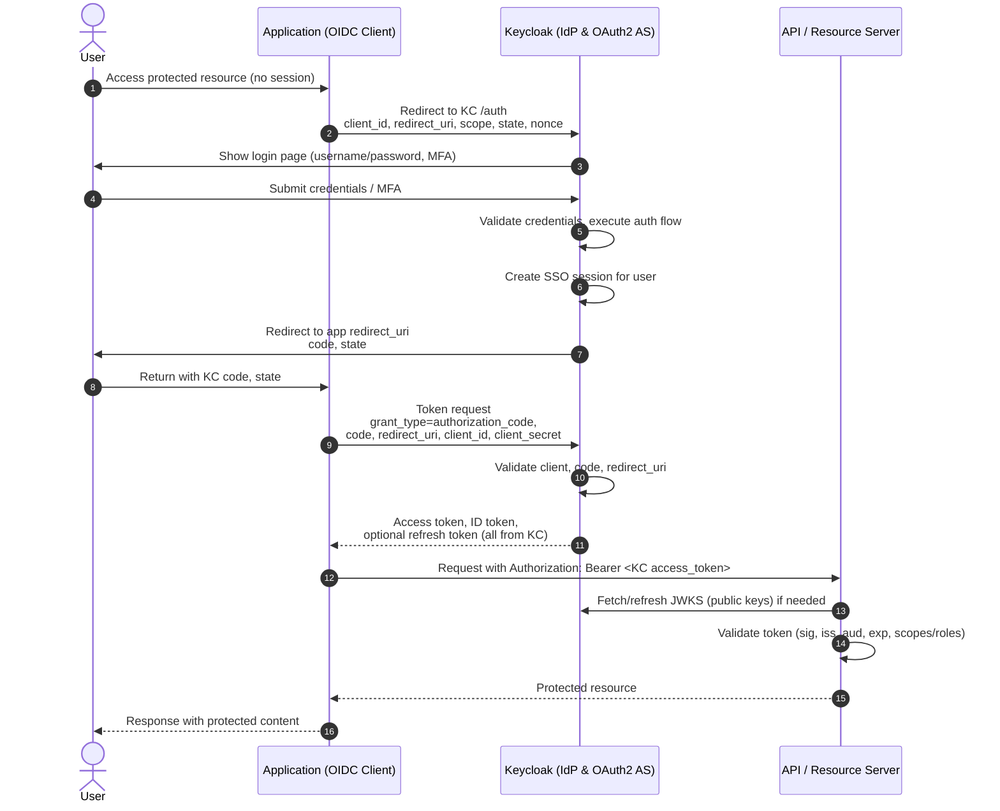
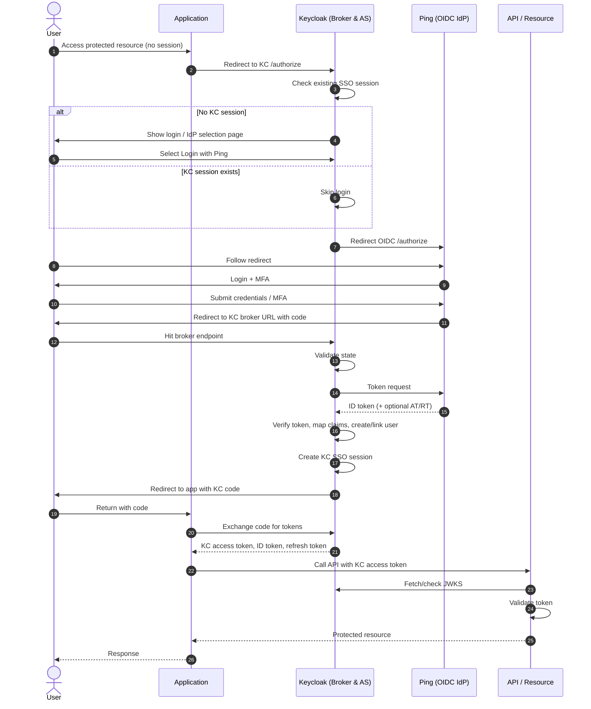

# Keycloak as Idp and OAuthz server

This diagram shows how Keycloak can act as both an Idp and an Authorization server to issue tokens to the application.

# Keycloak brokering to Ping

This diagram shows how Keycloak delegates login to Ping and then issues its own tokens to the application.

### Actors

- User (Browser)
- Application (OIDC client of Keycloak)
- Keycloak (Identity Broker, OIDC Provider for the app, OIDC client of Ping)
- Ping (PingFederate or PingOne, OIDC Identity Provider)
- API / Resource Server (validates Keycloak tokens)

***

### Sequence diagram (textual)

1. **User → Application**
    - Request: Accesses a protected URL at the application (no session or token yet).
2. **Application → Keycloak**
    - Redirect: OIDC Authorization Request (Authorization Code flow)
    - Includes: `client_id` (app), `redirect_uri` (back to app), `response_type=code`, `scope=openid ...`, `state`, `nonce`.
    - Goal: Ask Keycloak to authenticate the user and issue tokens.[^3][^1]
3. **Keycloak (internal)**
    - Check: Is there an active SSO session for this user in the realm?
    - If no session, start login flow.
4. **Keycloak → User (Browser)**
    - Option A: Show Keycloak login page with list of identity providers (including Ping).
    - Option B: If realm/client is configured with a default IdP or `kc_idp_hint=ping-oidc`, skip the list and auto‑select Ping.[^4][^1]
5. **User → Keycloak**
    - Action: User clicks “Login with Ping” (or equivalent) or Keycloak auto‑selects Ping.
6. **Keycloak → Ping**
    - Redirect: OIDC Authorization Request to Ping’s authorize endpoint.
    - Keycloak acts as an OIDC client of Ping.
    - Includes:
        - `client_id` (for Keycloak in Ping)
        - `redirect_uri` (Keycloak broker endpoint)
        - `response_type=code`
        - `scope=openid profile email ...`
        - `state`, `nonce`.[^2][^5]
7. **User (Browser) → Ping**
    - Request: Browser follows redirect, reaches Ping login experience.
8. **Ping ↔ User**
    - Flow: Ping displays its login and MFA screens and executes its policies (password, OTP, push, risk, etc.).
    - Result: User successfully authenticates with Ping.[^5]
9. **Ping → User (Browser)**
    - Redirect: Back to Keycloak’s broker redirect URI with:
        - `code` (Ping authorization code)
        - `state` (for CSRF correlation).
10. **User (Browser) → Keycloak**
    - Request: Hits Keycloak’s broker endpoint with `code` and `state`.
11. **Keycloak (internal) → Keycloak (internal)**
    - Validate:
        - `state` matches what was originally sent to Ping.
        - The response is tied to the expected IdP session.[^1]
12. **Keycloak → Ping (back‑channel)**
    - HTTP POST: Token request to Ping’s token endpoint.
    - Parameters:
        - `grant_type=authorization_code`
        - `code` (from Ping)
        - `redirect_uri` (Keycloak broker endpoint)
        - Client authentication: client secret or other method configured in Ping.[^2][^5]
13. **Ping → Keycloak**
    - Response: OIDC token set
        - `id_token` (with `sub`, `email`, `name`, groups, etc.)
        - Optionally `access_token`, `refresh_token` for Ping usage.
14. **Keycloak (internal)**
    - Verify Ping ID token signature and claims (issuer, audience, nonce, etc.).
    - Optionally call Ping’s UserInfo endpoint for extra claims, depending on IdP config.[^1][^2]
15. **Keycloak (internal) – user provisioning / linking**
    - Apply identity provider mappers:
        - Import or map attributes: `sub` → Keycloak `username`, `email` → `email`, groups → Keycloak roles/groups, etc.[^6][^2]
    - Check if a Keycloak user is already linked to this Ping identity.
        - If yes: load that user.
        - If no: create a new user and link to the Ping IdP entry (first‑login flow, optional consent/profile update).[^7][^1]
    - Create/refresh a **Keycloak SSO session** for this user.
16. **Keycloak (internal) → User (Browser)**
    - Now that Keycloak trusts Ping’s auth, Keycloak completes the **outer** login.
    - It issues its own authentication for the realm (auth cookie/session).
17. **Keycloak → User (Browser) → Application**
    - Redirect: Back to the application’s redirect URI with a **Keycloak authorization code** (for the app client).
    - Parameters: `code` (Keycloak), `state`.
18. **Application → Keycloak (back‑channel)**
    - HTTP POST: Token request to Keycloak’s token endpoint.
    - Parameters:
        - `grant_type=authorization_code`
        - `code` (Keycloak code)
        - `redirect_uri` (app redirect URI)
        - Client authentication: app client ID/secret or other method.[^3][^1]
19. **Keycloak → Application**
    - Response: OIDC token set for the app
        - **Access token** (JWT, issuer = Keycloak)
        - **ID token** (JWT, issuer = Keycloak)
        - Optional **refresh token**.[^3][^1]
20. **Application → API / Resource Server**
    - HTTP request with `Authorization: Bearer <Keycloak_access_token>`.
21. **API / Resource Server → Keycloak (JWKS)**
    - Retrieve or cache Keycloak’s public keys (JWKS).
    - Validate the access token signature, audience, issuer, expiry, etc.[^3]
22. **API / Resource Server (internal)**
    - Authorization: Enforce access based on roles/groups/scopes contained in the Keycloak token (which ultimately derive from Ping attributes, via Keycloak mapping).[^8][^2]
23. **API → Application → User**
    - Return the protected resource, user is now logged in end‑to‑end via Ping → Keycloak → App → API.

***

### Logout (high‑level sequence)

A matching logout flow often looks like:

1. User → Application: clicks “Logout”.
2. Application → Keycloak: redirect or back‑channel to Keycloak end‑session endpoint.
3. Keycloak:
    - Terminates its SSO session.
    - Optionally calls Ping’s logout (front‑channel/back‑channel) if configured for Single Logout.[^9][^2]
4. Keycloak → User → Application: redirect back to post‑logout URL.
5. User is logged out of app, Keycloak, and optionally Ping (depending on SLO config).

***