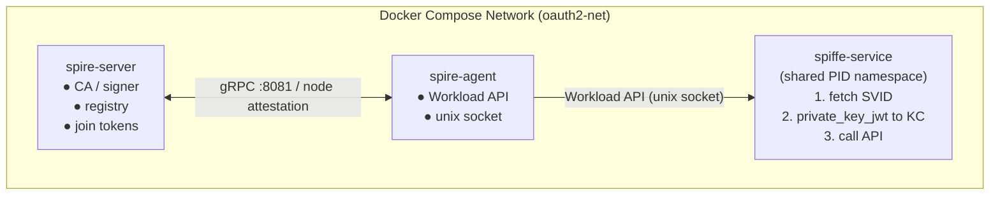
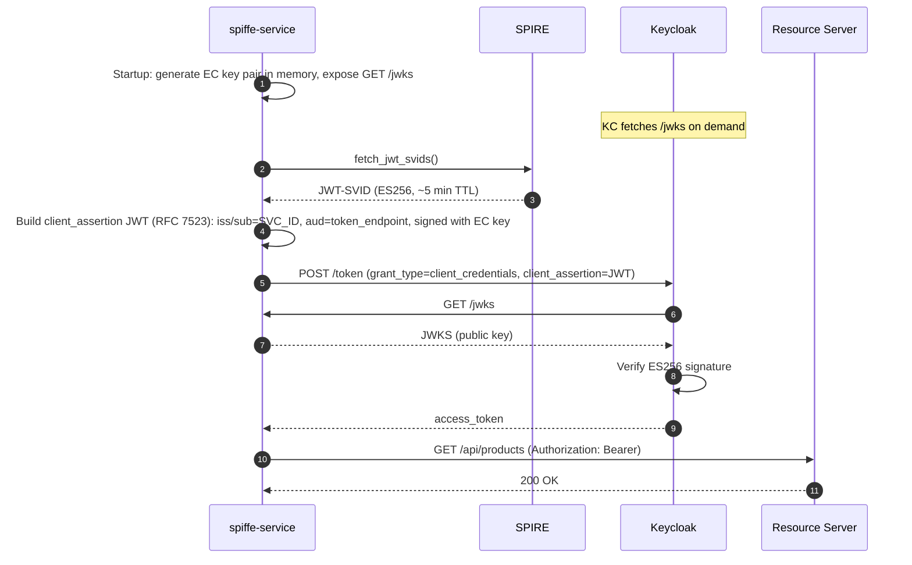
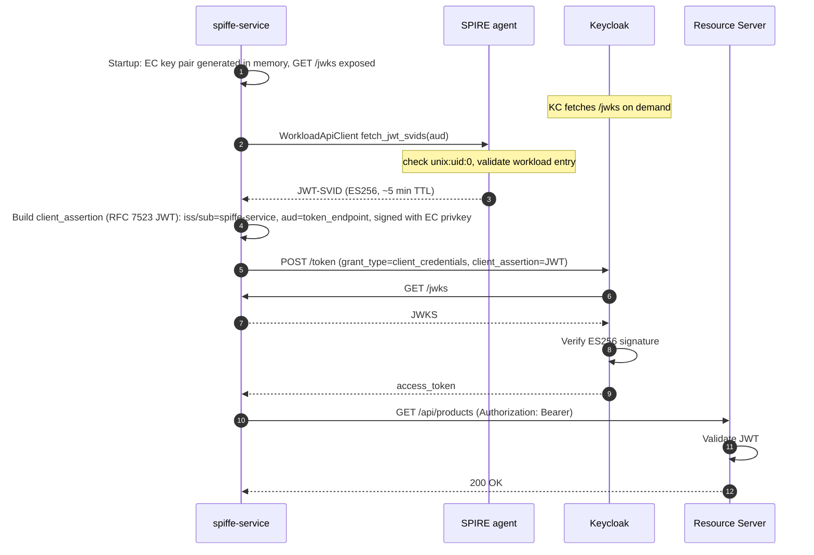
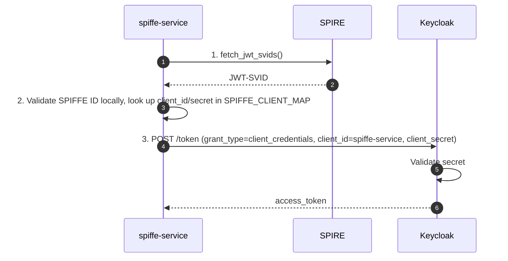

# SPIFFE / SPIRE + OAuth2 Integration

## Table of Contents

1. [What is SPIFFE?](#what-is-spiffe)
2. [Core Concepts](#core-concepts)
3. [SPIRE Architecture](#spire-architecture)
4. [JWT-SVID in Detail](#jwt-svid-in-detail)
5. [How This Demo Works (KC 26.4+ Native)](#how-this-demo-works-kc-264-native)
6. [How This Demo Is Wired](#how-this-demo-is-wired)
7. [Step-by-Step Flow](#step-by-step-flow)
8. [Legacy: The SPIFFE→OAuth2 Bridge Pattern](#legacy-the-spiffeoauth2-bridge-pattern)
9. [Security Properties](#security-properties)
10. [Comparison: SPIFFE vs Client Credentials](#comparison-spiffe-vs-client-credentials)
11. [Troubleshooting](#troubleshooting)

---

## What is SPIFFE?

**SPIFFE** (Secure Production Identity Framework for Everyone) is an open standard for
assigning and verifying identities to software workloads in dynamic, cloud-native environments.
It solves a fundamental problem: *how does a service prove who it is without a long-lived secret?*

The key insight is to bind identity to the **runtime environment** (the container, the OS process,
the Kubernetes pod) rather than to a credential that can be leaked and reused. Identity becomes
a property of *what the workload is*, not *what it knows*.

**SPIRE** (SPIFFE Runtime Environment) is the reference implementation. It consists of:

- **SPIRE Server** — the certificate authority and registry of workload identities
- **SPIRE Agent** — a node-local daemon that attests workloads and serves the Workload API

---

## Core Concepts

### SPIFFE ID

A SPIFFE ID is a URI with the scheme `spiffe://`:

```
spiffe://<trust-domain>/<workload-path>
```

Example from this demo:

```
spiffe://demo.local/spiffe-service
```

It identifies *what* the workload is, not *where* it runs. The trust domain (`demo.local`) scopes
the identity to a single administrative boundary.

### SVID (SPIFFE Verifiable Identity Document)

An SVID is a cryptographically signed document that carries a SPIFFE ID. There are two formats:

| Format | Use case |
|--------|----------|
| **X.509-SVID** | mTLS between services (long-lived, auto-rotated) |
| **JWT-SVID** | Bearer-token style API calls, OAuth2 integration |

This demo uses **JWT-SVIDs** because they integrate naturally with HTTP Authorization headers
and OAuth2 flows.

### Trust Domain

The trust domain is the root of the SPIFFE identity namespace. All SPIRE servers in a deployment
share a trust domain. Federation between trust domains is possible but out of scope for this demo.

### Workload Attestation

Attestation is the process by which SPIRE verifies that a workload is what it claims to be.
The SPIRE agent uses **workload attestors** to inspect the OS-level properties of a process:

| Attestor | Selector example | Notes |
|----------|-----------------|-------|
| `unix` | `unix:uid:0` | Matches processes by OS UID/GID |
| `docker` | `docker:label:com.docker.compose.service:myapp` | Requires Docker socket access |
| `k8s` | `k8s:ns:default` | Kubernetes pod selector |

This demo uses the **unix attestor** with `unix:uid:0` (root inside the container).

> **PID namespace note:** The unix attestor identifies callers via `SO_PEERCRED` on the
> Workload API socket. When the caller and agent run in separate Docker containers, they have
> separate PID namespaces — the agent cannot find the caller's PID in its own `/proc`. The fix
> is `pid: "service:spire-agent"` on `spiffe-service` in `docker-compose.yml`, which shares
> the agent's PID namespace so both sides see the same process table.

---

## SPIRE Architecture



### Bootstrap Sequence

1. **`spire-server`** starts and listens on gRPC port 8081.
2. **`spire-init`** (one-shot container, Alpine + spire-server binary):
   - Generates a **join token** with agent SPIFFE ID:
     `spiffe://demo.local/agents/demo-agent`
   - Registers the workload entry:
     - SPIFFE ID: `spiffe://demo.local/spiffe-service`
     - Selector: `unix:uid:0`
   - Writes the join token to a shared volume (`/tmp/spire-tokens/join-token`)
3. **`spire-agent`** (Alpine + spire-agent binary) reads the join token and connects to the
   server (node attestation via `join_token` plugin).
4. **`spiffe-service`** starts after the agent is healthy, sharing the agent's PID namespace,
   and connects to the Workload API over the shared unix socket.

---

## JWT-SVID in Detail

When `spiffe-service` calls the SPIRE Workload API, it receives a JWT-SVID like this:

### Header

```json
{
  "alg": "ES256",
  "kid": "<key-id from SPIRE server>",
  "typ": "JWT"
}
```

Note: SPIRE uses **ES256** (ECDSA P-256) for JWT-SVIDs, not RS256. Keycloak uses RS256 for
its own tokens — these are separate key pairs.

### Payload

```json
{
  "sub": "spiffe://demo.local/spiffe-service",
  "aud": ["spiffe://demo.local"],
  "iat": 1700000000,
  "exp": 1700000300
}
```

Key fields:

| Claim | Value | Meaning |
|-------|-------|---------|
| `sub` | `spiffe://demo.local/spiffe-service` | The workload's identity |
| `aud` | `spiffe://demo.local` | The intended recipient (prevents token reuse at other endpoints) |
| `iat` | Unix timestamp | Issued at (by SPIRE) |
| `exp` | `iat + 300` | Expires in ~5 minutes (enforced by SPIRE) |

---

## How This Demo Works (KC 26.4+ Native)

This demo runs on **Keycloak 26.6.1** and uses the **KC 26.4+ native RFC 7523
`private_key_jwt` client authentication**. No `client_secret` is stored or transmitted.

The key idea: instead of a static secret, `spiffe-service` generates an **ephemeral EC P-256
key pair** at process startup, exposes the public key via `GET /jwks`, and signs short-lived
JWT assertions with the private key. Keycloak validates those assertions by fetching `/jwks`.



### Why the JWT-SVID is not used directly as the client_assertion

The `client_assertion` in RFC 7523 requires `iss` and `sub` to equal the OAuth2 client ID
(`spiffe-service`). But SPIRE sets those claims to the SPIFFE ID
(`spiffe://demo.local/spiffe-service`) — Keycloak would not recognise it as the client.

The design used here keeps both identities separate:
- The **JWT-SVID** is fetched from SPIRE to demonstrate workload attestation (Step 1).
- A **separate RFC 7523 JWT**, signed with the service's own EC key, is used for client auth
  (Step 3). Keycloak validates it via `GET /jwks`.

This is the production-grade approach: the SPIRE identity confirms *which workload is running*;
the private_key_jwt mechanism secures the OAuth2 client handshake.

### Audience discovery

`KC_HOSTNAME=localhost` means Keycloak publishes its token endpoint as
`http://localhost:8080/realms/demo/...` (public URL). Inside Docker, requests are made via
`http://keycloak:8080/...`. Keycloak validates `aud` in the client assertion against its
*published* URL, so `spiffe-service/main.py` discovers the correct audience at startup by
calling `/.well-known/openid-configuration` and reading `token_endpoint`.

---

## How This Demo Is Wired

### Docker Compose services

| Service | Image / Build | Role |
|---------|--------------|------|
| `spire-server` | `ghcr.io/spiffe/spire-server:1.10.0` (official) | CA, registry, join tokens |
| `spire-init` | `./spire/init` (Alpine + spire-server binary) | One-shot: creates token + workload entry |
| `spire-agent` | `./spire/agent-wrapper` (Alpine + spire-agent binary) | Attestation + Workload API |
| `spiffe-service` | `./spiffe-service` (Python/FastAPI) | Demo workload — JSON API + HTML UI at `/ui` |

> **Why custom wrapper images?** The official SPIRE images are **scratch-based** (no shell,
> no shared libraries). `spire-init` and `spire-agent` need shell scripts to orchestrate
> startup. The wrapper Dockerfiles copy the statically-compiled SPIRE binary into Alpine,
> which provides `/bin/sh`.

### SPIFFE Service UI (port 8002)

`spiffe-service` ships a Bootstrap HTML UI alongside its JSON API:

| URL | Description |
|-----|-------------|
| `http://localhost:8002/ui` | Home — service config, auth-flow diagram, endpoint reference |
| `http://localhost:8002/ui/demo` | Interactive demo runner — click **Run Demo** to execute the 4-step SPIFFE → OAuth2 → API pipeline and see JWT claims rendered inline |
| `http://localhost:8002/jwks` | Public JWKS (Keycloak fetches this to verify `client_assertion`) |
| `http://localhost:8002/docs` | FastAPI / Swagger UI |

The HTML UI calls the existing `GET /demo` JSON endpoint via `fetch()` and renders each step (SVID claims, Keycloak access token claims, resource server response) in expandable cards without a page reload.

### Shared volumes

| Volume | Mounted in | Purpose |
|--------|-----------|---------|
| `spire-server-socket` | server + init | Server admin socket (gRPC) |
| `spire-agent-socket` | agent + spiffe-service | Workload API socket (unix) |
| `spire-tokens` | init (rw) + agent (ro) | Join token hand-off |

### SPIRE server config (`spire/server/server.conf`)

```hcl
server {
  bind_address = "0.0.0.0"
  bind_port    = "8081"
  socket_path  = "/tmp/spire-server/private/api.sock"
  trust_domain = "demo.local"
  data_dir     = "/tmp/spire-server-data"
  log_level    = "INFO"
}

plugins {
  DataStore "sql" {
    plugin_data {
      database_type     = "sqlite3"
      connection_string = "/tmp/spire-server-data/datastore.sqlite3"
    }
  }
  NodeAttestor "join_token" { plugin_data {} }
  KeyManager "memory" { plugin_data {} }
}
```

> `data_dir` uses `/tmp/spire-server-data` (not `/opt/spire/data/server`) to avoid conflicts
> with Docker named volumes that would shadow that path and prevent SQLite from creating its
> database file. `KeyManager "memory"` means keys are regenerated on each restart — fine for
> a demo, use `disk` or a cloud KMS in production.

### SPIRE agent config (`spire/agent/agent.conf`)

```hcl
agent {
  data_dir           = "/tmp/spire-agent-data"
  server_address     = "spire-server"
  server_port        = "8081"
  socket_path        = "/tmp/spire-agent/public/api.sock"
  trust_domain       = "demo.local"
  insecure_bootstrap = true   # skip initial bundle validation (dev only)
}

plugins {
  NodeAttestor "join_token" { plugin_data {} }
  KeyManager "memory"       { plugin_data {} }
  WorkloadAttestor "unix"   { plugin_data {} }
}
```

### Keycloak client (`spiffe-service`)

Declared in `realm-export.json` and ensured on every startup by `keycloak-init`:

```json
{
  "clientId": "spiffe-service",
  "serviceAccountsEnabled": true,
  "standardFlowEnabled": false,
  "clientAuthenticatorType": "client-jwt",
  "attributes": {
    "use.jwks.url": "true",
    "jwks.url":     "http://spiffe-service:8002/jwks"
  }
}
```

No `secret` field — the client authenticates exclusively via signed JWT assertions.
Keycloak fetches `GET /jwks` on `spiffe-service` to verify the ES256 signature.

> **Why `keycloak-init` provisions this client:** Keycloak only processes `realm-export.json`
> when the realm does not yet exist in PostgreSQL. If the realm was created before
> `spiffe-service` was added to the export, the client would be absent or misconfigured.
> `keycloak-init` calls `ensure_spiffe_service_client()` on every startup to create or
> migrate the client and assign the role to its service account — making the setup idempotent.

---

## Step-by-Step Flow



---

## Legacy: The SPIFFE→OAuth2 Bridge Pattern

> **Historical note:** The bridge pattern below was used before KC 26.4+ native client
> authentication was available. It is described here for reference only — this demo no longer
> uses it.

With older Keycloak versions (pre-26.4), the service could not authenticate to Keycloak using
the JWT-SVID directly. The workaround was a "bridge": look up the Keycloak client credentials
from a local mapping table indexed by SPIFFE ID, then use those credentials to obtain a token.



The bridge table in `spiffe-service/main.py`:

```python
SPIFFE_CLIENT_MAP: dict[str, tuple[str, str]] = {
    "spiffe://demo.local/spiffe-service": ("spiffe-service", "spiffe-service-secret"),
}
```

**Why this is inferior:**
- A static `client_secret` must still be stored somewhere — defeating the goal of zero secrets.
- An attacker who steals the secret can impersonate the service without any SPIRE attestation.
- The SPIFFE identity provides no cryptographic binding to the OAuth2 token request.

The KC 26.4+ native approach eliminates this entirely: the EC key is generated in memory at
startup, never persisted, and the JWKS endpoint rotates automatically on each restart.

---

## Security Properties

### What SPIFFE + private_key_jwt provides that Client Credentials does not

| Property | Client Credentials | SPIFFE + private_key_jwt |
|----------|-------------------|--------------------------|
| Identity proof | Secret known to the service | Runtime-attested OS identity + ephemeral key |
| Credential lifetime | Until manually rotated | Key regenerated on restart; assertion exp = 60 s |
| Leak risk | Secret can be copied and reused anywhere | Key is in-memory only; never persisted |
| Rotation | Manual or CI/CD pipeline | Automatic (new key on every restart) |
| Auditability | "The secret was used" | "This container, attested at time T, ran this workload" |
| Works without a secret store | No | Yes |

### Threat model

**Mitigated**: An attacker who exfiltrates the container's environment variables gets no
usable long-lived credential. The JWT-SVID expires in 5 minutes. The EC private key lives
only in process memory and is never written to disk.

**Not mitigated by SPIFFE alone**: An attacker who can exec into the running container can
still call the Workload API and receive a fresh SVID, and can access the in-memory key.
This is why SPIRE workload registration entries use precise selectors, and why network
policies / pod security contexts matter in production.

### Development simplifications in this demo

| Setting | Value | Production recommendation |
|---------|-------|--------------------------|
| `insecure_bootstrap` | `true` | `false` — pin the server's bundle |
| NodeAttestor | `join_token` | Use platform attestor (`k8s_psat`, `aws_iid`, etc.) |
| WorkloadAttestor selector | `unix:uid:0` (root) | Use a non-root UID, or `k8s` selectors |
| DataStore | SQLite | PostgreSQL or MySQL for HA |
| KeyManager | `memory` (keys lost on restart) | Cloud KMS (AWS KMS, GCP Cloud HSM) |
| PID namespace | `pid: "service:spire-agent"` | Dedicated host agent (DaemonSet in k8s) |
| EC key | In-memory only | HSM-backed key or TPM for higher assurance |

---

## Troubleshooting

### `spiffe-service` returns `"error": "SPIRE returned no JWT SVIDs"`

The workload entry was not registered or the selector does not match. Check:

```bash
docker compose exec spire-server \
  /opt/spire/bin/spire-server entry show -socketPath /tmp/spire-server/private/api.sock
```

You should see an entry with `unix:uid:0`. If it is missing, `spire-init` did not complete
successfully — check its logs: `docker compose logs spire-init`.

### `spiffe-service` returns `"Workload API call failed: …"`

The SPIRE agent socket is not reachable or the PID namespace is wrong. Check:

```bash
docker compose ps spire-agent
docker compose logs spire-agent | tail -30
```

The socket is at `/tmp/spire-agent/public/api.sock` (shared volume `spire-agent-socket`).
If the agent logs show `"could not resolve caller information"`, verify that
`pid: "service:spire-agent"` is set on `spiffe-service` in `docker-compose.yml`.

### `Keycloak returned 401: invalid_client` in the authentication step

The `spiffe-service` Keycloak client may be missing or misconfigured. Run:

```bash
docker compose run --rm keycloak-init
```

This will create or migrate the client to use `client-jwt` authentication and assign the
`user-role` to its service account.

### `Keycloak returned 400: invalid_token_audience` or `aud` mismatch

The `aud` in the `client_assertion` must match Keycloak's *public* token endpoint URL
(as published in `/.well-known/openid-configuration`), not the internal Docker hostname.
`spiffe-service` discovers this at startup via OIDC discovery. If Keycloak was unreachable
at startup, the service fell back to the internal URL. Restart `spiffe-service`:

```bash
docker compose restart spiffe-service
```

### SPIRE agent stuck waiting for join token

The `spire-init` container did not write the join token. Check:

```bash
docker compose logs spire-init
```

A common cause is that `spire-server` was not yet healthy when `spire-init` ran, but the
`depends_on: service_healthy` in `docker-compose.yml` should prevent this. If `spire-init`
shows `"SPIRE server did not become ready in time"`, restart with:

```bash
docker compose up spire-server spire-init
```

### Everything starts slowly on first run

On first `docker compose up --build`, Docker must pull the SPIRE images (~200 MB each) and
build the Python services. SPIRE also needs time to generate its CA key. The full stack can
take 3–5 minutes to become fully healthy. Use `docker compose ps` to watch health states.
